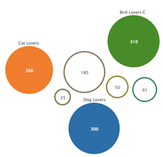
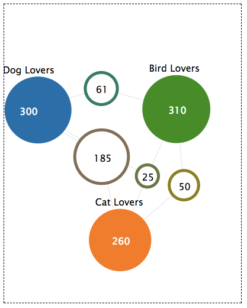
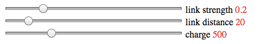

# g4s API Reference

g4s - shortcut for **Graph for Sets**, it's a javascript library, based on [D3.js](https://d3js.org), that visualizes sets and intersections in an intuitive way, aimed for easy insights discovery.

* [Data Format](#data-format)
* [Getting Started](#getting-started)
* [Layout Customization](#layout-customization)
* [Tuning Mode](#tuning-mode)

## Data Format
g4s expects to get data in the format of JSON object.

Consider the following example:

* Group A: 300 members
* Group B: 260 members
* Group C: 310 members
* A&cap;B = 85
* A&cap;C = 61
* B&cap;C = 50
* A&cap;B&cap;C = 25

Here is the JSON object g4s expects:

```json
[
 {"sets": [0],   "label": "Group A", "size": 300},
 {"sets": [1],   "label": "Group B", "size": 260},
 {"sets": [2],   "label": "Group C", "size": 310},
 {"sets": [0,1],   "size": 85},
 {"sets": [0,2],   "size": 61},
 {"sets": [1,2],   "size": 50},
 {"sets": [0,1,2],  "size": 25}
]
```

## Getting Started
g4s has only one third party prerequisite: the d3.js v4.x: https://github.com/d3/d3. Besides D3 you need to include in your HTML document g4s CSS file and the javascript library itself.

Include g4s.css in the <head> tag:

```html
<link rel="stylesheet" type="text/css" href="g4s.css">
```

At the botton of the <body> tag include the javascript library in this order:

```HTML
<script type="text/javascript" src="d3.js"></script>
<script type="text/javascript" src="g4s.js"></script>
```

g4s requires a div container in which it will build an SVG element that will host the interactive graph. For example:

```HTML
<div id="myg4s"></div>
```

To instantiate a g4s graph use the g4s.init API. Here is the function's full signature:
```javascript
g4s.init(data, container, tuning, height, width, charge, link_distance, link_strength)
```

However at minimum g4s.init requires just the first 2 parameters:

1. data - as [JSON object](#data-format)
2. container - the ID attribute of the div container

In our example:
```javascript
g4s.init(data, "myg4s")
```
Here is the fully functional example:
<p align="center">
  <a href="https://bl.ocks.org/Kirdan/ad774e98643ce93371b4c5b625dbfeba"></a>
</p>

## Layout Customization
### The Need for Customization
For most of the cases g4s will handle your data set without the need to customize anything. It will automatically scale the visualized sets and intersections to fit into the SVG frame. The library will also attempt the to layout the nodes, links and labels in a way that the titles are always visible. However since g4s is based on force-directed approach it means that its algorithm doesn’t fully control the layout, instead it runs a force simulation and by the end of the simulation the layout is finalized. This approach although being deterministic, is not 100% predictable. There may be some cases where the final layout will not be as easy to use as we wish. To address this g4s.init provides several ways to customize the layout.

### The Parameters
Here is g4s.init's full signature:
```javascript
g4s.init(data, container, tuning, height, width, charge, link_distance, link_strength)
```
#### tuning
Render a graph in tuning mode, including sliders that change some of the force parameters.
Tuning can be set to true or false, defaulting on false. More on this [below](#tuning-mode).

#### height and width
Sets the dimensions for the SVG frame. If height and width are not specified both will default to 800 pixels.

Example, the following set the frame's dimensions to 400px by 300px:
```javascript
get.init(data, "myContainer", false, 300, 400)
```
#### charge
The force-directed library makes the intersections repels each other by simulating electrostatic charge. The repulsion is proportional to the size of the intersection, as well as to a global coefficient - *charge*. The recommended range of charge value is between 0 to 2000. The default value is 500.

Example, the following set the charge to 100:
```javascript
get.init(data, "myContainer", false, null, null, 1000)
```

#### link_distance
The links, that connect sets to intersections, attempt to keep these nodes at a desired distance be either pushing or pulling them. This force simulates a physical spring force. The recommended range of link_distance is between 10 to 100. The default value is 20.

Example, the following set the desired distance to 50:
```javascript
get.init(data, "myContainer", false, null, null, null, 50)
```

#### link_strength
The difference between the link actual distance and its desired distance is affected by the link_strength parameter. It ranges between 1 to 0, where 1 means that the simulation will fully enforce the link_distance parameter and less than 1 means that it will relax it. The default value is 0.2.

Example, the following set the link strength to 0.8:
```javascript
get.init(data, "myContainer", false, null, null, null, null, 0.8)
```
The following example demonstrates custom use of all the parameters:

<p align="center">
  <a href="https://bl.ocks.org/Kirdan/e241c2cb1ea3507e099f2c0944464a9e"></a>
</p>

## Tuning Mode
In some cases fine tuning the parameters that are related to force-directed simulation may be tedious iterative process. To ease that pain g4s provide a convenient utility: Tuning Mode. In this mode 3 sliders will be rendered under the SVG frame, allowing to tune the **charge**, **link_distance** and **link_strength** parameters. Using the sliders will immediately change the graph and the parameters' value will be avilable for copy and pasting. To enable tuning mode simple set its parameter to true:
```javascript
get.init(data, "myContainer", true)
```
Live example:
<p align="center">
  <a href="https://bl.ocks.org/Kirdan/48353df2587e0cf0a7df78d615220cf9"></a>
</p>
